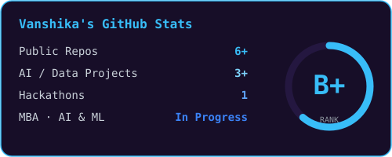
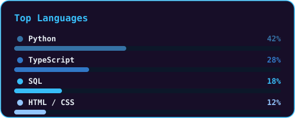
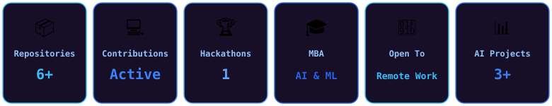

<div align="center">



<br/>


</div>

<br/>

<table align="center" border="0">
<tr>
<td width="34%" align="center" valign="middle">


</td>
<td width="66%" valign="middle">

### 🛰️ Featured Builds

| Project | Tech | Link |
|---|---|---|
| 📊 AI Business Analytics Platform | `Python` | [repo](https://github.com/Vanshika-gupta001/AI-Business-Analytics) |
| 📈 CampaignOS — AI Marketing Optimization | `Next.js` `TypeScript` `Tailwind` | [repo](https://github.com/shivadutt-singh/campaign-os) |
| 🧾 Internshala Analysis | `Python` | [repo](https://github.com/Vanshika-gupta001/internshala-analysis) |
| 🧩 Post-Mortem 2026 Prep | `Docs` | [repo](https://github.com/Vanshika-gupta001/port-mortem-2026-preparation) |

> ✨ *"I don't just analyze data, I decode it."*

</td>
</tr>
</table>

<br/>

## 🧭 How I Think About AI

```
   DATA  →  QUALITY  →  ANALYSIS  →  MODEL  →  VALIDATION  →  DECISION
```

<br/>

## 📊 GitHub Stats

<table align="center" border="0">
<tr>
<td align="center"></td>
<td align="center"></td>
</tr>
</table>

<br/>

<div align="center">


<br/><br/>



</div>

<br/>

## 🐍 Watch the Snake Eat My Contributions

<div align="center">

</div>

> Renders once the `snake.yml` workflow has run at least once (Actions tab → run it manually, or wait for the daily schedule).

<br/>

## 🟡 Watch Pacman Eat My Contributions

<div align="center">

</div>

> Renders once the `pacman.yml` workflow has run at least once (Actions tab → run it manually, or wait for the 12-hourly schedule).

<br/>

## 📫 Let's Connect

<div align="center">

<a href="mailto:vanshi.kag890@gmail.com"></a>
<a href="https://www.linkedin.com/in/vanshika-gupta-mba"></a>
<a href="https://github.com/Vanshika-gupta001"></a>

</div>

<br/>

<div align="center">

**Building intelligence, one dataset at a time.** ✨

</div>
